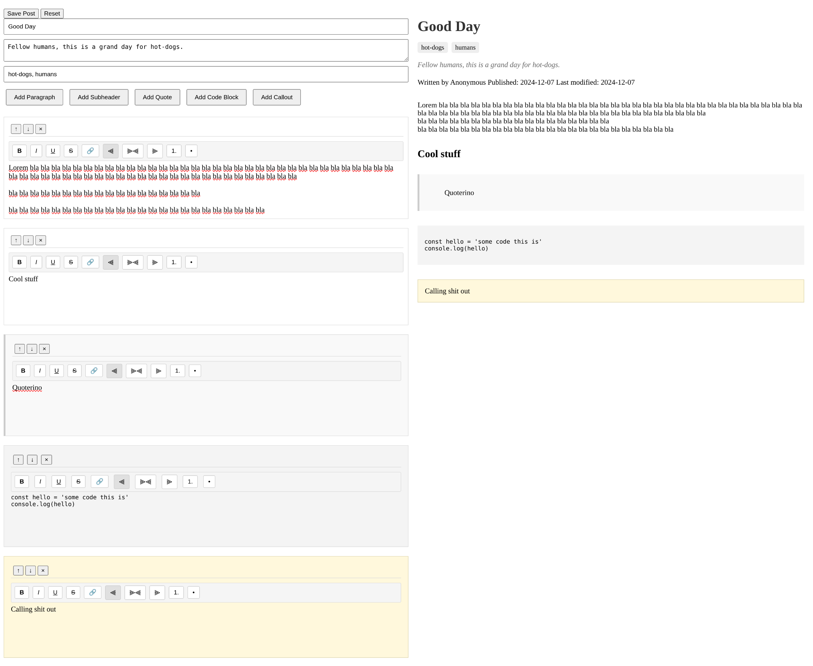

# Web Component Rich Text Editor - With Preview / Post Component

Disclaimer: this is a work in progress - and also very much meant for me at the moment. First to learn more about web-components, secondly - to use it with my own blog. Support not guaranteed.

This is a simple web component that allows you to create rich text content with a preview pane.
The preview pane also doubles as a post component so it can be used both for editing and displaying content.

These are meant to be used together, but if you want to use them independently, you will have to handle the data parsing yourself.

## Usage

### Editor with Preview



```html
<html>
  <head>
    <style>
      body {
        display: grid;
        grid-template-columns: 1fr 1fr;
      }
    </style>
  </head>
  <body>
    <mf-editor></mf-editor>
    <mf-post></mf-post>
  </body>
  <script>
    const editor = document.querySelector("blog-editor");
    const post = document.querySelector("blog-post");

    editor.addEventListener("update", (e) => {
      // Updates the preview in the blog-post element
      post.setPostData(e.detail);
    });

    editor.addEventListener("save", (e) => {
      // Save the post data to your server / database
      console.log(e.detail);
    });
  </script>
</html>
```

### Post Component

```html
<html>
  <body>
    <mf-post></mf-post>
  </body>
  <script>
    const post = document.querySelector("blog-post");
    // However you get the post data from your server / database, you can set it on the post component
    post.setPostData(dataFromServer);
  </script>
</html>
```

## Events

The `blog-editor` element emits the following events:

- `update`: Fired when the editor content is updated. The event detail contains the post data. At the moment, only when adding/removing/moving sections. Typing does not trigger this event.
- `save`: Fired when the post is saved. The event detail contains the post data. Use this event to save the post data to your server / database.

## Styling

The `blog-editor` component uses the following CSS classes:

- `editor-wrapper`: The wrapper for the editor.
- `editor-container`: The container for the editor.
- `section-container`: The container for each section.
- `section-toolbar`: The toolbar for each section.
- `section-content`: The content for each section.
- `quote-section`: The style for quote sections.
- `code-section`: The style for code sections.
- `callout-section`: The style for callout sections.
- `formatting-toolbar`: The formatting toolbar.
- `formatting-toolbar button`: The formatting toolbar buttons. (including :hover and :active states)
- `post-meta`: The container for the post metadata.
- `post-meta input`: The input for the post title.
- `post-meta textarea`: The textarea for the post summary.
- `post-meta input`: The input for the post tags.
- `add-section-controls`: The container for the add section controls.
- `add-section-controls button`: The add section controls buttons.

The `blog-post` component uses the following CSS classes:

- `blog-post`: The wrapper for the post.
- `post-tags`: The container for the post tags.
- `post-tag`: The style for each post tag.
- `post-summary`: The style for the post summary.
- `post-content`: The style for the post content.
- `post-paragraph-section`: The style for paragraph sections.
- `post-subheader-section`: The style for subheader sections.
- `post-text-section`: The style for text sections.
- `post-quote-section`: The style for quote sections.
- `post-code-section`: The style for code sections.
- `post-callout-section`: The style for callout sections.

You can override these styles by adding a custom stylesheet to your page.
